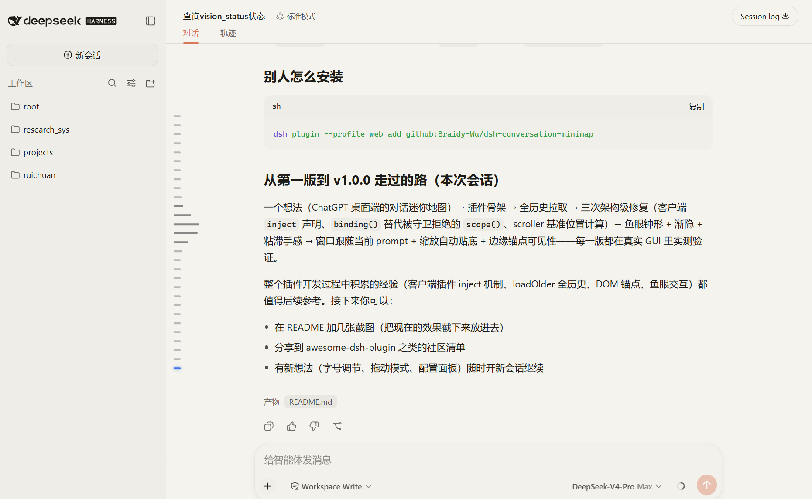

# dsh-conversation-minimap

English | [中文](README.zh.md)

A DeepSeek Harness (DSH) Web GUI plugin: **Prompt-based Conversation Minimap** — a ChatGPT-desktop-style navigation rail for long conversations.

- **Anchors**: one capsule per user prompt, evenly spaced, centered in the rail
- **Fish-eye**: bars magnify on a Gaussian bell curve toward the right under the cursor (44px peak), stay magnified while the pointer moves inside the enlarged area, slide smoothly
- **Edge fade**: the rail fades at the top/bottom via a mask — overflowing anchors fade out and never exceed the rail bounds
- **Position tracking**: a blue glowing highlight follows the current prompt (switches when the prompt's center crosses the viewport center); after window resizes the view snaps back to the bottom and the visible anchors always follow where you are
- **Interaction**: hover shows the full prompt preview; click smooth-scrolls to that message and highlights it for 2s (no stuck highlights on rapid clicks)
- **Full history**: pulls the entire conversation via the official `loadOlder` API, so every prompt in a long conversation is reachable



## Installation

```sh
dsh plugin --profile web add github:Braidy-Wu/dsh-conversation-minimap
```

Restart `dsh web`.

## Configuration (cordis.patch.yml, all optional)

```yaml
- insert:
    - id: conversation-minimap
      name: dsh-conversation-minimap
      config:
        enabled: true    # master switch
        minPrompts: 4    # show the rail once the session has at least this many user prompts (0 = always)
        anchorSize: 6    # anchor dot diameter, px
```

## How it works

- **Data**: pulls full history through the official `ctx.sessions` + `conversation.loadOlder()` API; observes the rendered conversation DOM — user messages carry `data-chat-flow-kind="user"` (and `steering`), jump targets use the rows' `data-chat-anchor-key` (the same mechanism the official UI scrolls by)
- **Mounting**: an absolutely positioned seat on the conversation viewport wrapper — no layout impact; edge clipping + mask fade
- **Updates**: MutationObserver on the message list (debounced + key-set diff, no jitter while streaming); polling handles session switches; nothing renders during history sync — the full rail appears at once
- **Safety**: everything is guarded by try/catch; any unexpected failure only disables the minimap, never the GUI

A plain-vanilla-JS client plugin (`inject: ['sessions']`, mirroring the `dsh-theme-plugin` shape) with no build step and no dependencies.

## Development

```sh
node --check client.js index.js   # syntax check
# smoke test: test/smoke.html + python3 -m http.server
```

## License

MIT
